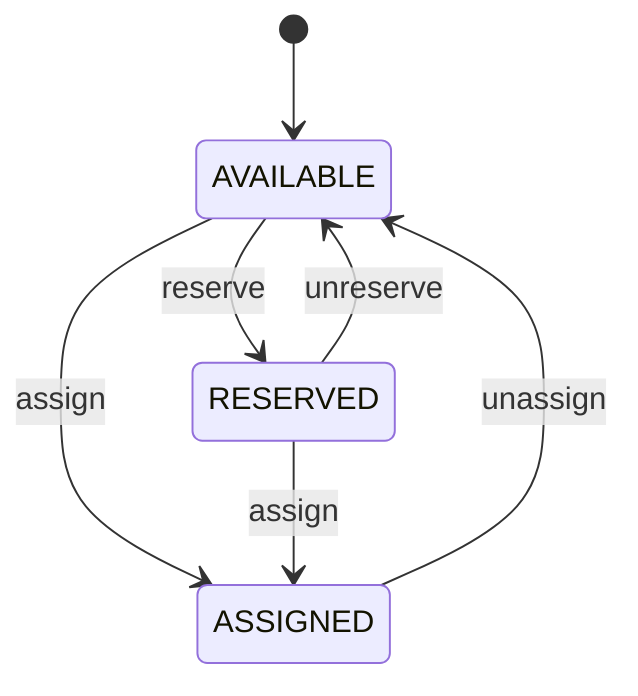
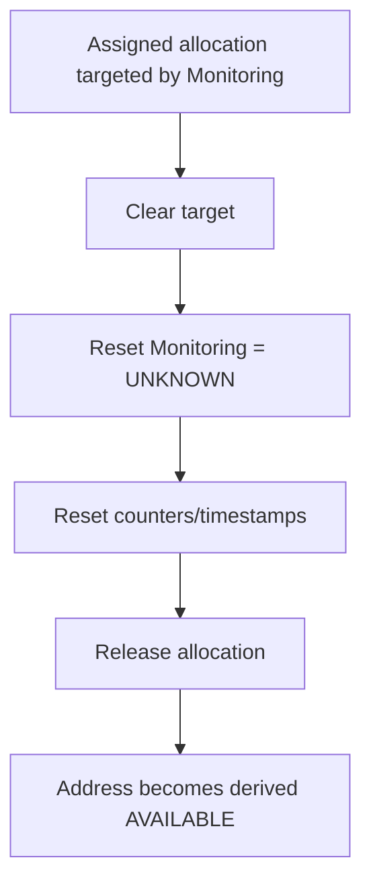
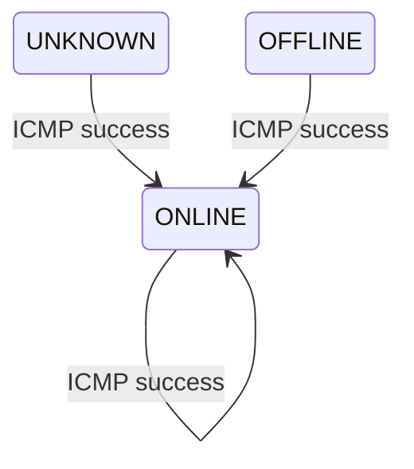
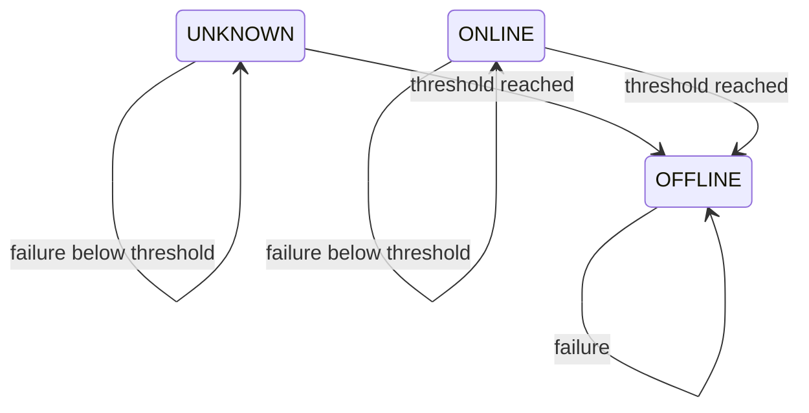

# STATE MACHINES — Phase 1

**Project:** IPAM & Network Inventory Management System  
**Milestone:** M0-03 / M0-04  
**Owner:** 02 — Technical Lead / System Architect  
**Status:** M0 DESIGN BASELINE  
**Date:** 2026-08-24

# 1. IP Allocation State Machine

## 1.1 Conceptual states

```text
AVAILABLE
RESERVED
ASSIGNED
```

Important persistence rule:

- `AVAILABLE` is **derived**, not persisted.
- `RESERVED` is persisted.
- `ASSIGNED` is persisted.

## 1.2 Locked transitions



Equivalent transition table:

| From | Operation | To | Persistence effect |
|---|---|---|---|
| AVAILABLE | reserve | RESERVED | INSERT allocation: `reserved`, `interface_id=NULL` |
| AVAILABLE | assign | ASSIGNED | INSERT allocation: `assigned`, `interface_id!=NULL` |
| RESERVED | unreserve | AVAILABLE | DELETE reserved allocation |
| RESERVED | assign | ASSIGNED | UPDATE allocation to `assigned` + Interface |
| ASSIGNED | unassign | AVAILABLE | DELETE/release assigned allocation after monitoring cleanup |

## 1.3 Invalid transitions

The API must reject invalid state operations, including:

- unreserve an `assigned` allocation;
- assign an already `assigned` allocation to another Interface;
- reserve an already persisted allocation;
- assign Network/Broadcast/out-of-range address;
- assign to an Interface that already has an assigned IPv4;
- unassign a `reserved` allocation.

## 1.4 Validation before transition

For Reserve and Assign:

```text
address belongs to Subnet
AND address is usable
AND address != Network
AND address != Broadcast
AND no allocation conflict
AND DB constraints pass
```

For Assign:

```text
Interface exists
AND Interface has no assigned IPv4
```

For Reserved → Assigned:

```text
allocation.status == reserved
AND allocation.interface_id == NULL
```

## 1.5 Concurrency rule

For the same IP:

```text
Request A ─┐
            ├─ same IP
Request B ─┘

Expected:
1 success
1 conflict
```

The database uniqueness constraint is the final protection.

For the same Interface:

```text
Request A ─┐
            ├─ same Interface
Request B ─┘

Expected:
at most 1 assigned IPv4
```

## 1.6 Targeted allocation release

If an `ASSIGNED` allocation is a Monitoring Target:



The allocation must not be released first because that would create a dangling Monitoring Target.

# 2. Monitoring State Machine

## 2.1 Locked state set

```text
UNKNOWN
ONLINE
OFFLINE
```

`OFFLINE` means the configured ICMP target did not respond sufficiently many consecutive times. It does not prove that the Device is physically powered off.

## 2.2 State meanings

### UNKNOWN

Possible when:

- never monitored;
- no target selected;
- target just changed;
- target removed/unassigned;
- there is not yet enough monitoring evidence.

### ONLINE

The current target responded successfully to ICMP.

### OFFLINE

Consecutive failures reached `OFFLINE_THRESHOLD`.

## 2.3 Success transition

From any monitoring state:

```text
ICMP success
→ status = ONLINE
→ consecutive_failures = 0
→ last_check = now
→ last_seen = now
```



## 2.4 Failure transition

On each failure:

```text
consecutive_failures += 1
last_check = now
```

If:

```text
consecutive_failures < OFFLINE_THRESHOLD
```

then keep the current state.

If:

```text
consecutive_failures >= OFFLINE_THRESHOLD
```

then:

```text
status = OFFLINE
```

Default:

```text
OFFLINE_THRESHOLD=3
```



## 2.5 Target creation/change — M0-LOCKED

When a target is newly selected or changed:

```text
target = new assigned allocation
status = UNKNOWN
consecutive_failures = 0
last_check = NULL
last_seen = NULL
enqueue immediate check
```

Immediate check uses the same job queue as scheduled checks.

## 2.6 Target removal — M0-LOCKED

```text
target = NULL
status = UNKNOWN
consecutive_failures = 0
last_check = NULL
last_seen = NULL
```

Monitoring Check remains persisted.

## 2.7 Stale-result guard — LOCKED

A queued job snapshots:

```text
device_id
check_id
target_allocation_id
target_ip
```

Before persisting a result:

```text
Current Target == Job Target ?
```

If false:

```text
discard stale result
```

Do not update:

- status;
- last_check for the new target;
- last_seen;
- consecutive_failures.

## 2.8 Job-state constraints

- one Monitoring Check has at most one active job;
- scheduled and immediate checks share the same queue;
- do not start a new full monitoring cycle while the previous cycle is still running;
- no distributed scheduler or distributed lock is required in Phase 1.

## 2.9 `enabled=false` — OPEN

The persistent `enabled` field exists conceptually, but exact dashboard/state behavior when disabled remains OPEN for M6/M7.

Constraints while OPEN:

- disabled checks must not be scheduled;
- no new `DISABLED` monitoring state may be added without Architecture Change Request;
- Engineering must not invent dashboard counting semantics before Tech Lead locks the decision.

# 3. State-machine test matrix

## IP Allocation

- available → reserved succeeds for usable free IP;
- available → assigned succeeds for usable free IP + free Interface;
- reserved → assigned succeeds directly;
- reserved → available deletes allocation;
- assigned → available deletes allocation;
- network/broadcast reserve/assign rejected;
- duplicate assignment rejected;
- concurrent same-IP assignment → one success, one conflict;
- concurrent same-Interface assignment → at most one assignment.

## Monitoring

- UNKNOWN + success → ONLINE;
- ONLINE + failures below threshold → ONLINE;
- UNKNOWN + failures below threshold → UNKNOWN;
- threshold reached → OFFLINE;
- OFFLINE + success → ONLINE;
- success updates `last_seen`;
- every actual attempt updates `last_check`;
- target change resets state and stale old result is discarded;
- target removal resets state and prevents dangling reference;
- scheduled + immediate duplicate results in at most one active job.
